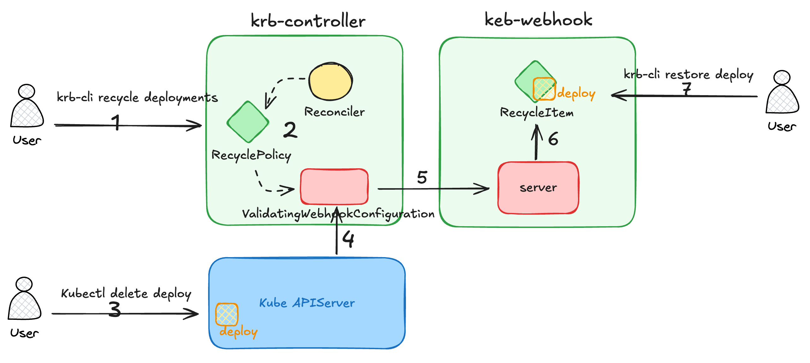

# kube-recycle-bin

English | [简体中文](README_zh-CN.md)

kube-recycle-bin(krb) is a Kubernetes resource recycling bin that can automatically recycle and quickly restore deleted resources.

> In Kubernetes, resource deletion is an irreversible operation. While there are methods like Velero or etcd backup/restore that can help us recover deleted resources, have you ever felt that in practical scenarios, "using a sledgehammer to crack a nut" is excessive?
>
> Then try kube-recycle-bin!

## Features

Since it is a recycling bin, its main functions are:

1. Recycle: Supports recycling all Kubernetes resource types and allows specifying namespaces.
2. Restore: 100% restoration of recycled resources.

## Principle



1. Use the `krb-cli recycle` command to create a `RecyclePolicy` resource, specifying the resource types and namespaces to be recycled.
2. The `krb-controller` watching for the creation, update, and deletion of `RecyclePolicy` resources, automatically synchronizing the creation, update, and deletion of corresponding `ValidatingWebhookConfiguration` resources.
3. The `kube-apiserver` receives the deletion request for the specified resource and forwards the request to `krb-webhook` through `ValidatingWebhookConfiguration`.
4. The `krb-webhook` parses the request and stores the deleted resource (in JSON format) into a new `RecycleItem` resource object, completing the resource recycling.
5. Use the `krb-cli restore` command to restore the recycled resource. After the resource is restored, the `RecycleItem` resource object is automatically deleted.

## Deploy

1. Install CRDs

```bash
kubectl apply -f https://raw.githubusercontent.com/ketches/kube-recycle-bin/master/manifests/crds.yaml
```

2. Deploy `krb-controller` and `krb-webhook`

```bash

kubectl apply -f https://raw.githubusercontent.com/ketches/kube-recycle-bin/master/manifests/deploy.yaml
```

## Install CLI

Multiple installation methods are available:

1. Install using `go install` command:

```bash
go install github.com/ketches/kube-recycle-bin/cmd/krb-cli@latest
```

2. Use the script (suitable for Linux and MacOS):

```bash
curl -sSL https://github.com/ketches/kube-recycle-bin/raw/master/install_cli.sh | sh
```

3. Download the corresponding binary file for your operating system from the [Release](https://github.com/ketches/kube-recycle-bin/releases) page, extract it, and move `krb-cli` to a directory in your `$PATH`.

4. Install from source code:

```bash
git clone https://github.com/ketches/kube-recycle-bin.git
cd kube-recycle-bin
make install
```

## Guide

Note: The prerequisite is that `krb-controller` and `krb-webhook` have been successfully deployed.

Scenario: Automatically recycle deleted `Deployment`, `StatefulSet`, and `Service` resources in the `dev` and `prod` namespaces.

1. Create a recycling policy

```bash
# Create recycle policies
krb-cli recycle deployments statefulsets services -n dev,prod

# Check the created recycle policies
kubectl get rp
```

2. Restore the recycled resource

```bash
# First, create test resources
kubectl create deployment krb-test-nginx-deploy --image=nginx --replicas=0 -n dev
kubectl expose deployment krb-test-nginx-deploy --name krb-test-nginx-svc --port=80 --target-port=80 -n dev

# Delete test resources
kubectl delete deploy krb-test-nginx-deploy -n dev
kubectl delete svc krb-test-nginx-svc -n dev

# Check the recycle bin. Execute the following command to get the deleted resources, indicating that the recycling policy has taken effect.
krb-cli get ri

# View the recycled resource objects using the resource name obtained from the above command
krb-cli view krb-test-nginx-deploy-skk5c89b krb-test-nginx-svc-txv4vj6v

# Restore the recycled resource objects
krb-cli restore krb-test-nginx-deploy-skk5c89b krb-test-nginx-svc-txv4vj6v

# Check the restored resources
kubectl get deploy krb-test-nginx-deploy -n dev
kubectl get svc krb-test-nginx-svc -n dev
```
